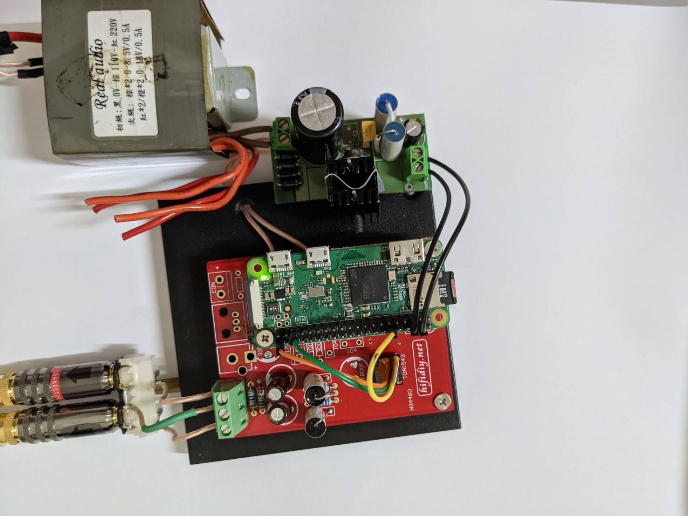
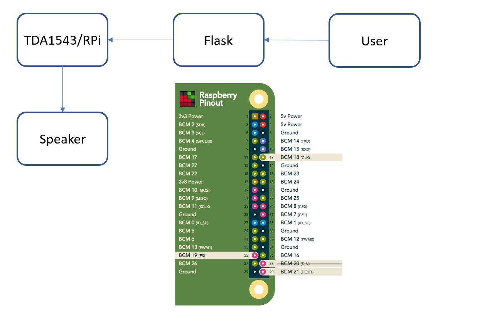
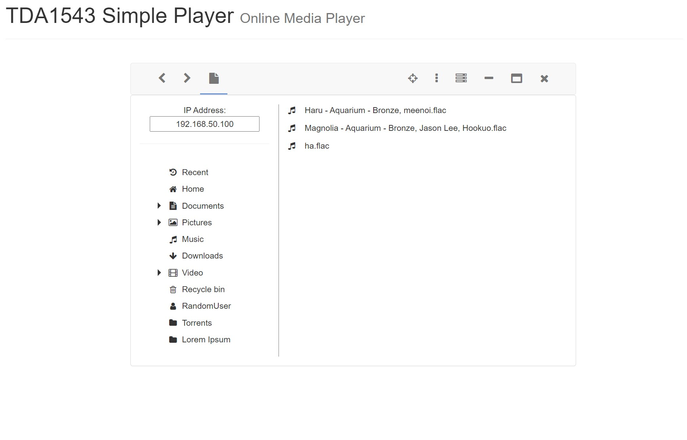
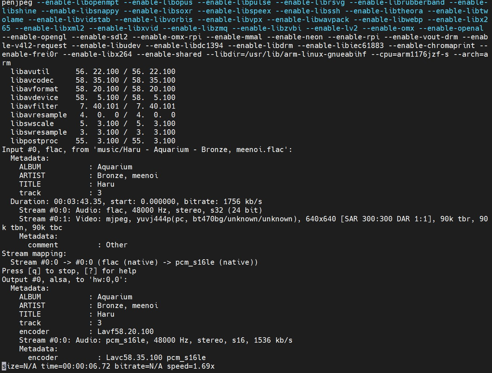

# TDA1543 Online Player


這是一個由 16bit DAC 和 Raspberry PI Zero W 組合的媒體播放器。

[電路參考](https://aroundwaves.wordpress.com/2015/01/23/malinowy-dac-dla-i2s-na-tda1543-lub-1541-cz-3/)



架構：



操作介面(WEB)：



後端(播放音樂)：




## 驅動 i2s：

### 編輯 **boot.txt**

選用任一個您常用的編輯器

```
sudo nano /boot/config.txt
```

### 修改設定

取消以下字串的註解

```
dtparam=i2s=on
```

註解以下字串

```
#dtparam=audio=on

```

將以下字串加入檔案未尾

```
dtoverlay=hifiberry-dac
```

### 建立 **asound.conf**

```
sudo nano /etc/asound.conf
```

加入以下內容

```
pcm.!default  {
 type hw card 0
}
ctl.!default {
 type hw card 0
}
```

播放器 API 可選用 [ffmpeg](https://www.ffmpeg.org/) 或 [ALSA](https://www.alsa-project.org/wiki/Main_Page)
